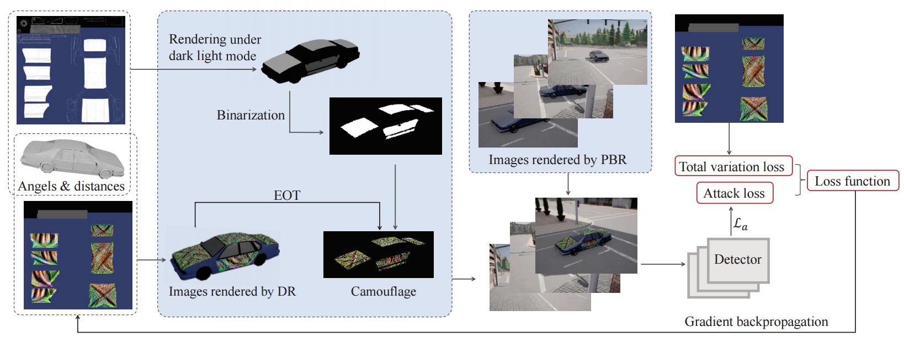

# PAV-camou: Crafting Physical Adversarial Examples by Combining Physically Based Renders and Differentiable Renders


[](https://arxiv.org/abs/2505.04662)
[]()

[**Yuqiu Liu**](https://autumnyq.github.io/), [**Huanqian Yan**](), [**Xiaopei Zhu**](https://scholar.google.com/citations?user=BwtdKHMAAAAJ), [**Xiaolin Hu**](https://www.xlhu.cn/), [**Liang Tang**](https://scholar.google.com/citations?hl=en&user=aPWa50IAAAAJ), [**Hang Su**](https://www.cs.tsinghua.edu.cn/csen/info/1313/4403.htm), [**Chen Lv**](https://lvchen.wixsite.com/automan)

[Beijing Forestry University](https://english.bjfu.edu.cn/About/index.htm); [Tsinghua University](https://www.tsinghua.edu.cn/en/); [Nanyang Technological University](https://www.ntu.edu.sg/)




### Citation
```bibtex
@article{liu2025crafting,
  title={Crafting Physical Adversarial Examples by Combining Differentiable and Physically Based Renders},
  author={Liu, Yuqiu and Yan, Huanqian and Zhu, Xiaopei and Hu, Xiaolin and Tang, Liang and Su, Hang and Lv, Chen},
  journal={arXiv preprint arXiv:2505.04662},
  year={2025}
}
```
